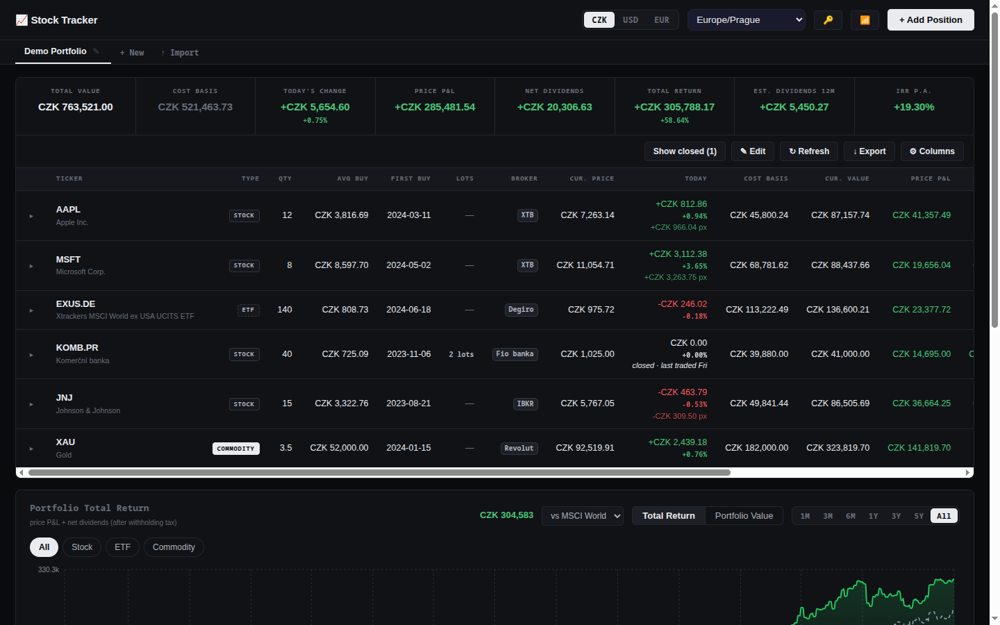
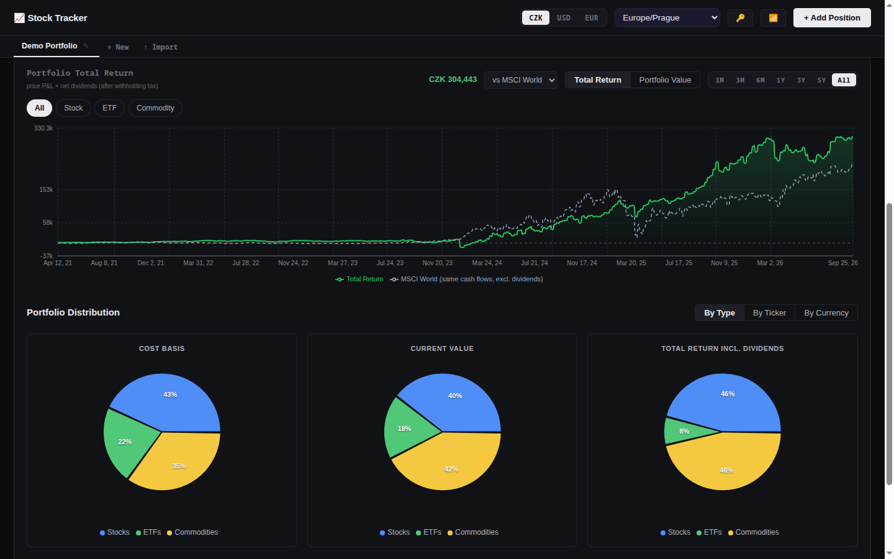
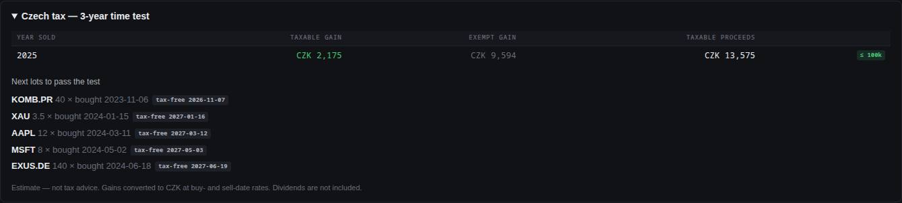
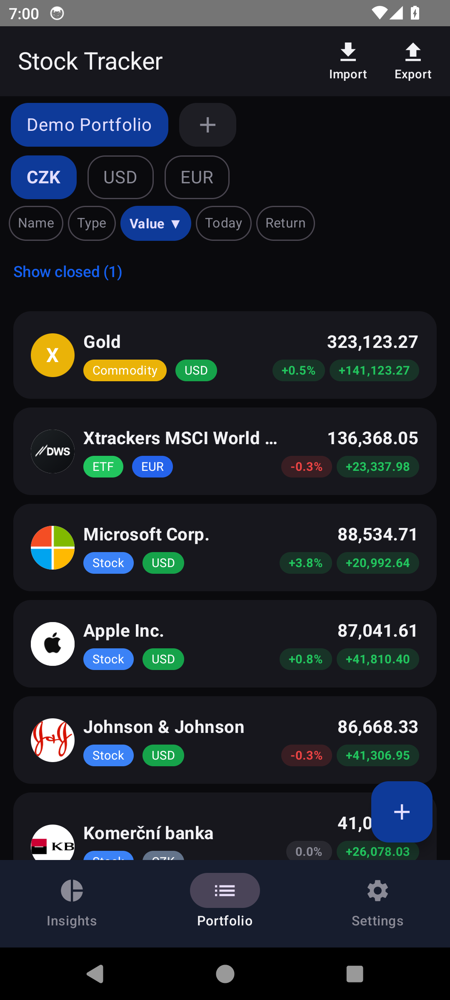
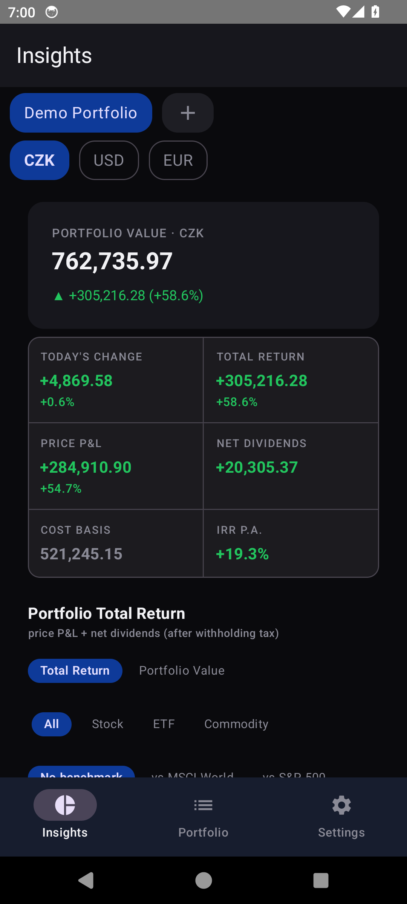
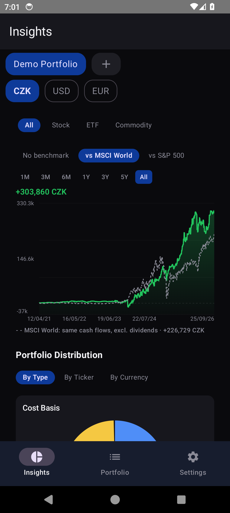
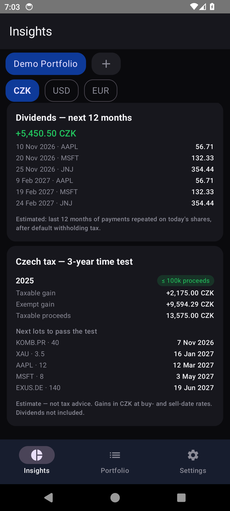
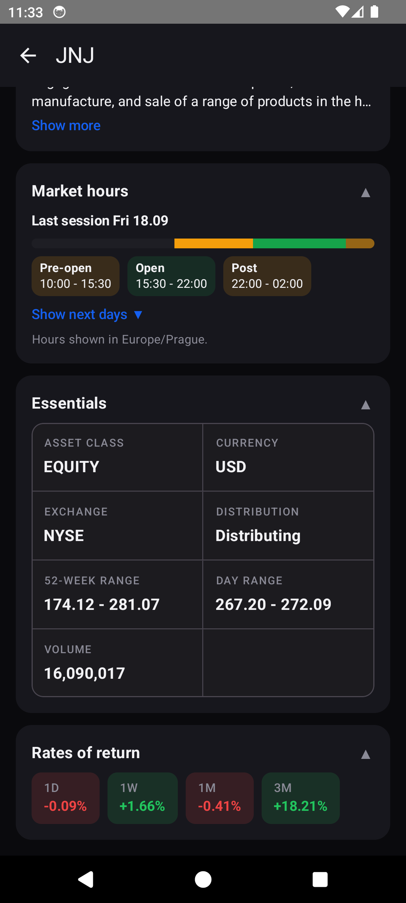

# Stock Tracker

A self-hosted portfolio tracker for Czech and international stocks, ETFs, funds, commodities, and crypto. It has a web app and a native Android app, and both sync through your own small server.

**📱 [Download the latest Android APK](https://github.com/59man/STOCK_APP_2/releases/latest)**



*All screenshots show a demo portfolio of invented positions, not real holdings.*

## Features

- **Multiple portfolios, any currency.** Totals and charts switch between CZK, USD, and EUR instantly.
- **Live prices.** Prices come from Yahoo Finance, with Stooq as a fallback. Onemarkets and Fio funds are fetched from the providers' own sites. You can still set a price by hand for anything without a feed.
- **Returns.** Shows realized and unrealized P&L, net dividends after per-country withholding tax (editable per payout), and IRR per position and per portfolio.
- **Full position lifecycle.** Buy, sell partially or fully, record past closed positions, and edit individual lots.
- **Today's change that means today.** The figure resets at midnight in *your* time zone, not at the exchange's previous close, and includes the currency's own move. On a closed market it reads `0.00` and says why, rather than quietly showing Friday's number.
- **Charts.** Portfolio total return and value over time (converted at each day's historical FX rate), distribution pies, and a price chart per position. Chips narrow the chart to stocks, ETFs, funds, commodities or crypto.
- **Benchmark.** A dashed MSCI World or S&P 500 line shows what the same buys and sells, on the same dates, would have earned in the index.



- **Czech 3-year time test.** Realized gains per year split into taxable and exempt (in CZK, at buy- and sell-date rates), a flag for years where taxable sales stayed within 100,000 CZK, and the date each open lot becomes tax-free. An estimate, not tax advice.
- **Dividend forecast.** Expected net dividends for the next 12 months, with a calendar of expected payments, based on the last 12 months repeated on the shares you hold now.



- **Import.** Reads XTB, Fio banka, Revolut, Trading 212, and Degiro statements, plus any CSV or XLSX through a column-mapping wizard. Sells are matched FIFO, and tickers and types are resolved from ISINs automatically.
- **Export.** One JSON backup covers positions, manual prices, and tax overrides.
- **Durable storage.** Writes are atomic, and the server keeps daily backups for the last 7 days. The Docker image includes a healthcheck.

### Android app

The Android app is native Kotlin + Jetpack Compose.

<table>
<tr>
<td width="33%"></td>
<td width="33%"></td>
<td width="33%"></td>
</tr>
<tr>
<td width="33%"></td>
<td width="33%"></td>
<td width="33%"></td>
</tr>
</table>

- **Offline-first.** Everything is calculated on the phone. Quotes and history come straight from Yahoo, and your server is used only for sync.
- **Full add/edit/sell/delete.** It's not a read-only mirror of the web app.
- **Statement import on the phone.** Handles all five broker formats.
- **Conflict-safe sync.** Edits made offline on both devices are merged. If the same record changed in both places, the app asks you which version to keep.
- **Instrument detail.** Market hours drawn in your own time zone, an essentials grid (exchange, ISIN, 52-week range, distribution type, fees), period returns, and the fund or company description.
- **Same insights as the web.** Type filter, benchmark line, Czech tax card and dividend forecast. A shared test fixture runs one portfolio through both apps' calculations and fails if any figure differs by more than 0.01.
- **Price alerts.** A notification when a price crosses a level you set, checked every 15 minutes, once per crossing.
- **Home-screen widget.** Portfolio value and today's change, as the app last computed them.

## Quick start

```bash
cp .env.example .env    # set PERSIST_API_KEY and VITE_PERSIST_API_KEY to the same secret
npm install
npm run dev             # web on http://localhost:5173, persist server on :3001
npm test                # unit tests
npm run test:ui         # Playwright layout checks across five viewports
```

`npm run dev` still works without `.env` (the server logs a warning), but production refuses to start without a key. If port 3001 is taken, run `kill $(lsof -ti:3001)`.

## Docker

```bash
docker compose up -d --build     # port 8080, data + backups bind-mounted
```

Or build the image and run it on a server:

```bash
docker build -t 59man/stock-tracker:latest --build-arg VITE_PERSIST_API_KEY=<secret> .
docker push 59man/stock-tracker:latest

docker run -d --name stock-tracker -p 4000:8080 \
  -v /DATA/stock-tracker/data.json:/app/server/data.json \
  -v /DATA/stock-tracker/backups:/app/server/backups \
  -e PERSIST_API_KEY=<secret> \
  --log-opt max-size=10m --log-opt max-file=3 \
  --restart unless-stopped \
  59man/stock-tracker:latest
```

- **Use absolute paths for the volume mounts.** A `~/…` path can point to a different file, and the app would then start empty.
- **Changing `VITE_PERSIST_API_KEY` needs a rebuild.** It's baked into the frontend when the image is built.
- **`PERSIST_API_KEY` only needs a restart.** The server reads it at runtime.
- **To update,** run `docker pull`, then `docker stop stock-tracker && docker rm stock-tracker`, then repeat the `docker run` command above.

## Android

Install the APK from [Releases](https://github.com/59man/STOCK_APP_2/releases/latest). You'll need to allow installing from unknown sources. Then open **Settings** in the app and enter your server URL and API key. The web app's 🔑 button shows the API key.

Build from source:

```bash
cd android
./gradlew :app:assembleDebug   # → app/build/outputs/apk/debug/app-debug.apk
./gradlew test                 # unit tests
```

## Architecture

- **Web.** React 18 + Vite + TypeScript. Express serves the build, proxies Yahoo, Stooq, and the fund providers, and stores data in `server/data.json`.
- **Android.** A multi-module Gradle project in `android/`: Room, WorkManager sync, and Hilt, with the calculations in `core:calc`.
- **Details.** `CLAUDE.md` has the data flow, storage keys, and calculation rules. `android/docs/mobile-sync-blueprint.md` covers the sync design.

Portfolio data lives in `server/data.json` and `server/backups/`. Both are excluded from git and from the Docker image.
